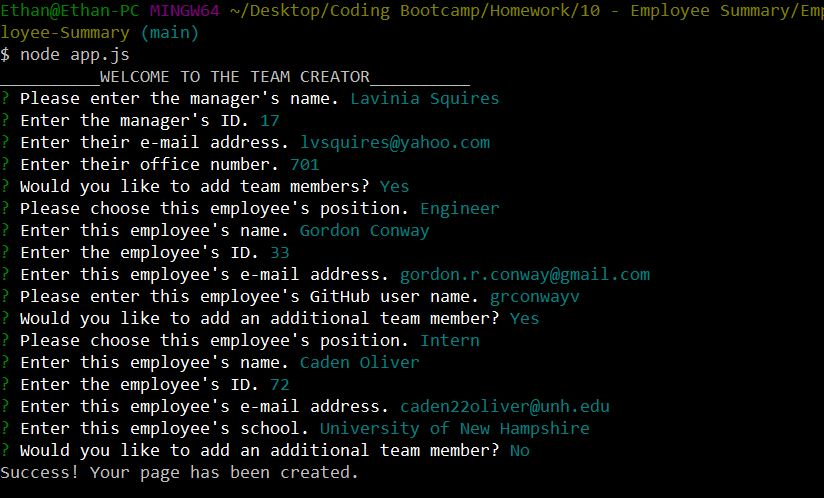
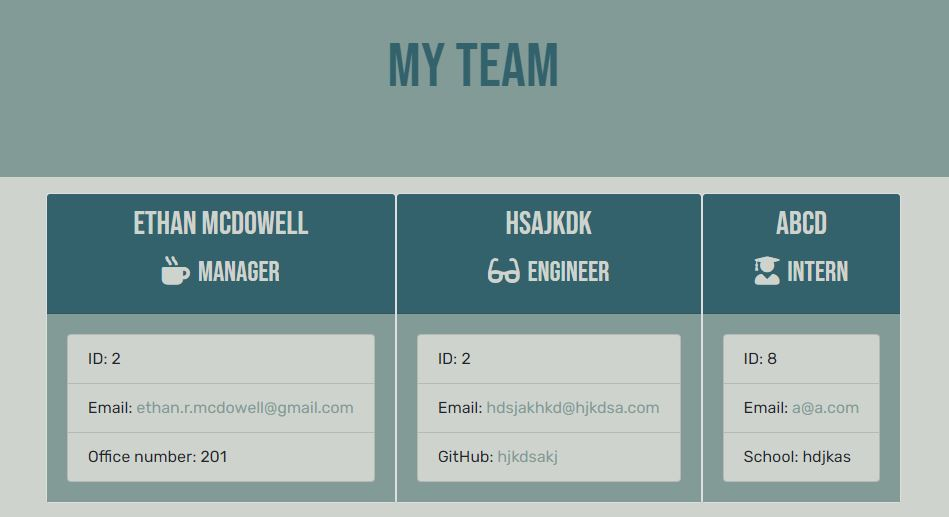
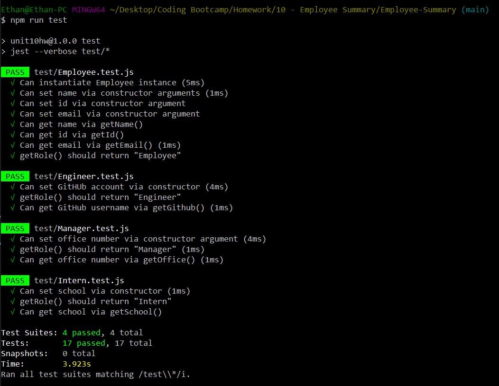

  
  # **Employee Summary**

  

  This CLI application prompts users for information on management and employees for a team. The program then generates an HTML page displaying the information.

  ## TABLE OF CONTENTS

  - [Features](#Features)
  
  - [Installation](#Installation) 

  - [Screenshots](#Screenshots) 

  - [Tests](#Tests) 

  - [Questions](#Questions) 

  ## Features

  - Uses inquirer.js to prompt user for data.
  - Utilizes inquirer 'when' statements to ask role-specific questions defined by user inputs.
  - Validates response to each question involving user input.
    - Includes functional e-mail validation.
  - Utilizes inquirer.js UI functions to present a header upon starting application.
  
  ## Installation
  
 `npm install` 

  ## Screenshots

  
  

  ## Tests
  
 `npm run test` 

 

  ## Questions
  
 :link: https://github.com/ethanrmcdowell
  
  
 :e-mail: ethan.r.mcdowell@gmail.com

